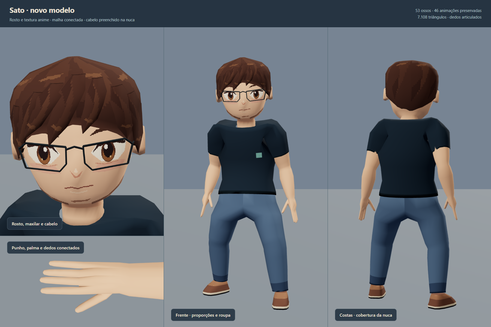

# Sato runtime model



`sato.glb` is the current runtime character. Its appearance is rebuilt around
the existing Quaternius bind pose, following the supplied low-poly anime
references. It has 7,108 triangles and embeds its two nearest-filtered pixel
textures. There are no external model or texture requests at runtime.

The head has separate chin, mandibular and cheek contour stations, a small
integrated nose, painted brown anime eyes, brows and a restrained smile.
The continuous head/neck surface replaces the previous open, toothy mouth.
Slim graphite spectacles, chestnut hair, a midnight shirt, slate trousers and
brown sneakers keep Sato recognizable. A filled hair cap follows the back of
the skull down to the nape, with swept front locks and restrained painted
highlights. All hair is bound exclusively to `DEF-head`.

Each arm, wrist, palm, thumb and four fingers is one connected, closed surface.
Support rings blend the existing elbow, wrist and phalanx influences. The
trousers share a crotch seam and taper into the sneakers. Their forefoot uses
the existing toe joints; a small heel bevel clears the floor through the
grounded clips without changing any animation.

The 53 bone transforms, hierarchy, inverse bind matrices and **all 46 clips**
are byte-identical to anatomy revision 1 (`2448a33`). This includes the 45 source
clips and `Hands_Open_Close`, the source pistol articulation, and the authored
punch, sword and torch grips. Tests check the complete 7,185-channel animation
fingerprint against that baseline. glTF Validator reports zero errors and
zero warnings.

## Authoring and verification

The deterministic authoring source is `tools/style-sato.mjs`. It rebuilds
geometry and draws the two pixel atlases, then repacks the referenced buffer
views while copying original animation and inverse-bind bytes unchanged.
The exported `sato-style-face.png` and `sato-style-hair.png` are also available
beside the GLB for texture editing.

To regenerate, provide the anatomy-revision-1 `static/models/sato.glb` from
commit `2448a33` (or the merge commit `71e6b74`):

```sh
node tools/style-sato.mjs path/to/anatomy-revision-1.glb static/models/sato.glb
npm run test:avatar
```

`npm run style:sato -- input.glb output.glb` accepts the same arguments.
Applying style revision 1 to an already styled asset is a byte-preserving
no-op. `sato-source.glb` and the older `build-sato.mjs` use the earlier rig and
are not the input for this pipeline. `refine-sato.mjs` remains the authoring
source for the preceding anatomy/contact/grip revision.

For an editable Blender file with packed textures and the 46 action clips:

```sh
blender --background --factory-startup --python tools/export-sato-blend.py -- static/models/sato.glb path/to/sato-anime.blend
```

The Blender authoring export welds coincident vertices and restores compatible
quads, retaining UV seams as corner data. Its camera and lights are in a
separate preview collection. The runtime GLB is not re-exported through
Blender, so its animation fingerprints remain exact.

`npm run test:avatar` checks actual finger deformation, ground clearance,
connected manifold arm/hand surfaces, texture orientation, jaw/nape contours,
all-clip finite deformation and lab jump/attack blending. The browser avatar
and model-inspector tests cover WebGL rendering, playback, isolation and GLB
download. The original 10 supplied screenshots are visual references; they
are not baked into the character textures.

## Runtime animation and inspector

`lab-avatar.js` blends `Rig|Idle_Loop`, `Rig|Walk_Loop` and `Rig|Sprint_Loop`
from explicit controller intent. Jump uses Jump_Start → Jump_Loop → Jump_Land
with a controller-owned height arc; punches alternate Jab/Cross. Backward
movement reverses the gait, and lateral travel turns the hips while the torso
follows aim. Footstep and action cues and reduced-motion behavior are retained.

Open `/models` directly to inspect all clips, pause/scrub/step playback,
change speed, orbit, view bones/wireframe and isolate meshes. It uses the
same `sato.glb` as the lab and plays its raw clips without controller blending.
**Baixar GLB** returns the original asset bytes. **Abrir GLB local** previews
Blender revisions without uploading or replacing site assets.

## Editable floating companion

`companion.glb` is the separate home robot: 43 editable meshes, its rigid joint
hierarchy, embedded optic texture and five transform clips (idle and four
banking directions). The home continues to use `lab-rigs.js` and `poseRig`;
`companion-model.js` exports that same factory without batching. Shader glow,
material-opacity animation and emission flashes remain runtime effects.

To regenerate that snapshot, select the floating robot in `/models`, choose
**Baixar GLB**, and replace `companion.glb`. Integrating a revised robot into
the home requires updating its procedural source or explicitly migrating it
to the revised GLB in a separate change.
