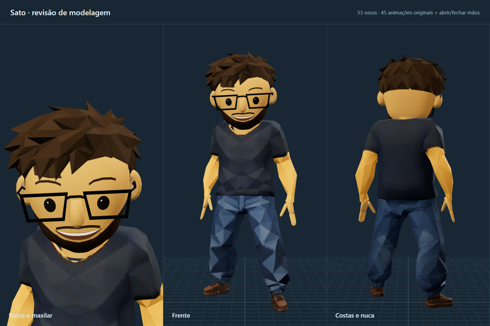

# Sato runtime model

`sato-source.glb` is the original Sato asset. `sato.glb` is the runtime replacement: it keeps Sato's appearance and repaired face while using the Quaternius humanoid skeleton and animation set.

The runtime asset contains 53 bones, the 45 original clips and a `Hands_Open_Close` audition, including the clips used by the lab:

- `Rig|Idle_Loop`
- `Rig|Walk_Loop`
- `Rig|Sprint_Loop`
- `Rig|Jump_Loop`

The application aliases these to `Idle`, `Walk`, `Run` and `Jump` and blends idle, walking and running based on movement speed. `createSatoAvatar().jump()` triggers the one-shot jump clip. The rest of the Quaternius clips remain available in the GLB for future interactions.

The face was rebuilt from the supplied reference: the glasses are straight, thin and black; the eyes sit close to the face; the forehead is clean; and the beard, eyebrows and smile use separate clean materials. The source and generated GLBs have embedded textures, so production does not need a model service or CDN.

The 53-bone hierarchy and 45 animations were verified after export. The GLB validator reports zero errors and zero warnings.


## Face and locomotion revision

The runtime GLB now has a projected chin, wider mandibular corners, a closed nose
embedded into the face, symmetric ears with inner folds, and a shorter rear hair
silhouette. The 53-bone rig and all 45 source clips are retained.

`lab-avatar.js` selects walking/running from explicit controller intent, uses
Jump_Start → Jump_Loop → Jump_Land with a controller-owned arc, and alternates
Punch_Jab/Punch_Cross. Full-body actions fade against locomotion with normalized
weights. The hips steer into lateral travel while the torso follows aim; backward
movement reverses the gait. Foot contacts, takeoff, landing and punches emit sound
cues. Ambient reduced motion keeps direct jump/attack input available.

Checks: `npm run test:avatar`, `npm run test:controls`, `npm run test:navigation`.
The revised GLB passes glTF Validator with zero errors and zero warnings.

## Model inspector and editable companion

Open `/models` directly (there is deliberately no navigation link). It exposes
all 46 Sato clips, play/pause, scrubbing, a 30 fps frame step, speed and loop
controls, orbit/zoom/pan, wireframe, bones, mesh isolation and geometry counts.
Sato uses the original `sato.glb` in both the inspector and the laboratory.
The inspector plays the raw asset clips, without the lab's locomotion blending
or its controller-owned jump trajectory.

`companion.glb` is an editable snapshot of the home robot: 43 separate meshes,
the rigid joint hierarchy, embedded optic texture and five transform animation
clips (idle and four banking directions). Import it into Blender to edit the
meshes/materials or keyframes. The home still uses `lab-rigs.js` and `poseRig`;
`companion-model.js` uses that same factory without batching, and samples its
joint transforms into glTF clips. Shader glow, animated material opacity and
emission flashes are runtime effects, not baked material animation in the GLB.

To regenerate the snapshot after changing the robot source, select the floating
robot in `/models`, choose **Baixar GLB**, and replace `companion.glb`. Sato's
download returns the original GLB bytes. **Abrir GLB local** previews exported
Blender revisions in the browser without uploading or changing site assets.
To integrate a revised robot into the home, its procedural source must be
updated or explicitly migrated to the revised GLB in a subsequent change.

## Anatomy and hand skinning revision



The current `sato.glb` keeps the original Quaternius hierarchy, inverse bind
matrices, rest transforms and animation names. Its face uses distinct cheek,
mandibular and chin stations. The beard is a material region of that same head
surface and ends behind the ears; it is not a second overlapping shell. The
smile is an actual aperture with recessed dark walls/back and ivory teeth in
front of the cavity. The old mouth overlays and residual textured head fragments
have been replaced. Eyes and brows follow the revised face surface.

The original spiky hair is trimmed above the nape and weighted entirely to
`DEF-head`, removing the former shoulder influences. Boots are fitted to the
ankle/toe span, the trouser cuffs taper into them, and the forefoot uses the toe
joints. Baked leg IK corrects residual sole penetration in grounded clips while
preserving thigh/shin lengths and the source foot pitch. Root/hip motion and the
jump controller are unchanged. Swimming,
rolling, sitting, death and the airborne jump loop retain their original foot
tracks because they do not use the same standing contact constraint.

New palm and finger meshes use all 30 existing finger bones. Pistol animations
retain the source trigger/support-hand articulation. Punch clips close both
hands; sword and torch clips grip with the right hand. These are baked into the
GLB and therefore also work in the inspector and after Blender import. The
additional `Hands_Open_Close` clip animates only the fingers for a simple grip
audition; all 45 source clips remain available.

Regenerate from the unrefined Quaternius runtime asset at Git revision `7471367`
(`static/models/sato.glb`), not `sato-source.glb`, which uses the earlier rig:

```sh
node tools/refine-sato.mjs path/to/unrefined-sato.glb static/models/sato.glb
npm run test:avatar
```

`npm run refine:sato` also accepts those input/output arguments after `--`.
Reapplying revision 1 to an already refined file is a byte-preserving no-op.
The older `build-sato.mjs` is the authoring pipeline for the earlier rig and is
not this Quaternius refinement pipeline.

Design references supplied for this revision:

- [Character Prompt Builder](https://github.com/euan-gwd/comfyui-character-prompt-builder): explicit face, hair, hand/prop anchors.
- [Character Design](https://github.com/khanhhuyenngo985-sys/character-scene-design-skills/blob/main/skills/character-design/SKILL.md) and its [bone/face layer](https://github.com/khanhhuyenngo985-sys/character-scene-design-skills/blob/main/skills/character-design/references/bone-face-structure-layer.md): proportions, jaw structure and consistent front/side/back contours.
- [Character Reference Sheet](https://github.com/ShinChven/nano-banana-skills/blob/main/skills/character-reference-sheet/SKILL.md): preserve the supplied character's appearance across close-up and full-body views.
- [Video Prompting character sheets](https://github.com/Square-Zero-Labs/video-prompting-skill/blob/main/video-prompting/references/workflows/character-sheets.md): stable silhouette, hand/prop poses and a motion audition.

These guide visual consistency; the geometry, skin weights and animation fixes
are authored directly in the GLB. Regression checks exercise actual deformed
vertices, mouth ray intersections, native grips and the lab's attack blending.
